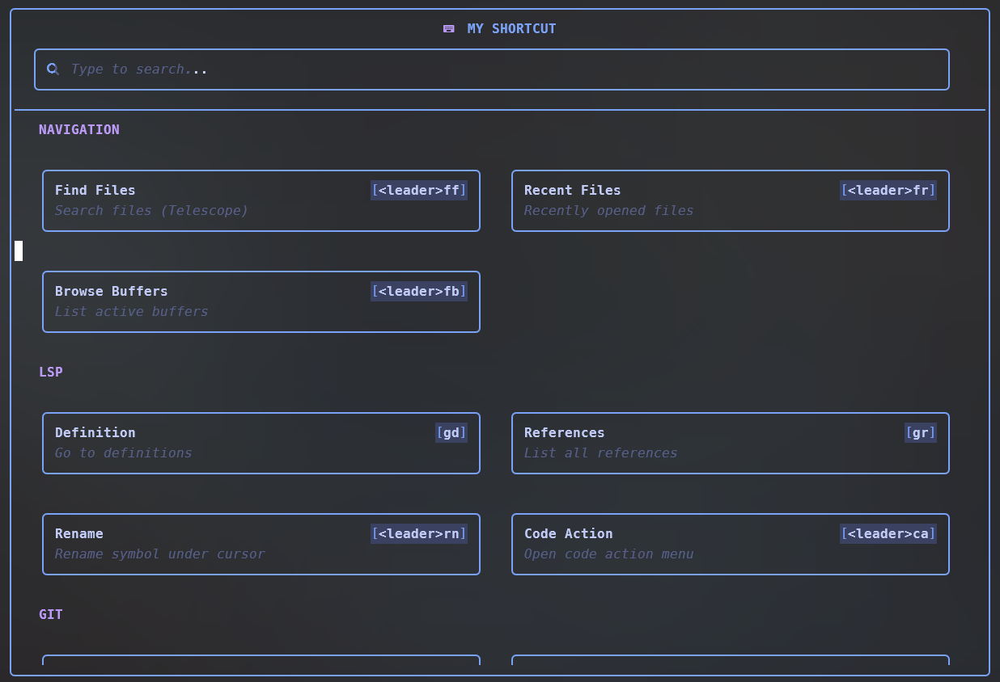
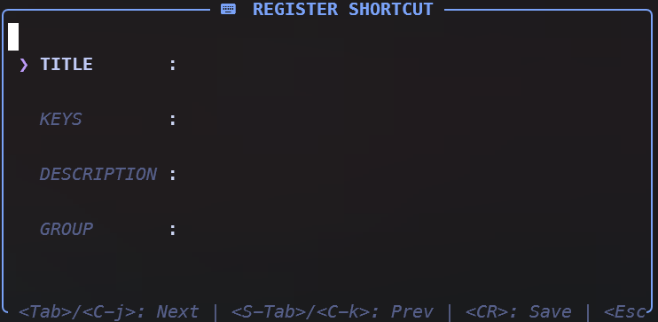
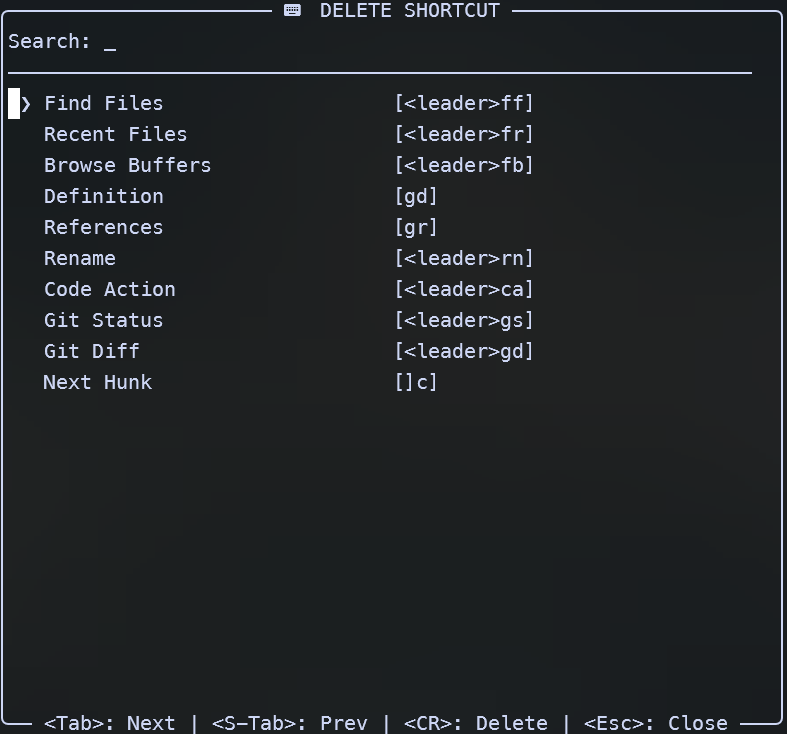

# show-key.nvim

A premium, searchable Neovim shortcut viewer popup with manual grouping, modern card-based UI, and interactive management.

## 📸 Screenshots

| Shortcut Viewer | Registration Form | Deletion Manager |
| :---: | :---: | :---: |
|  |  |  |

## ✨ Features

- 🔍 **Reactive Search**: Filter shortcuts by title, keys, description, or group as you type.
- 📦 **Manual Grouping**: Organize your keymaps into custom categories.
- 🎨 **Premium UI**: Modern 2nd-generation grid with specific windows for Header and Body (Sticky Header).
- 󰌌 **Dual-Window System**: Sticky header keeps your title and search box always visible.
- 🌫️ **Transparency**: Full support for transparent backgrounds and curated color palettes.
- 🖱️ **Interactive Management**: Register or Delete shortcuts via dedicated UIs.
- 🛡️ **Confirmation System**: Safety prompts before deleting shortcuts to prevent accidents.

## 📦 Installation

### [lazy.nvim](https://github.com/folke/lazy.nvim)
```lua
{
  "phamminhkhoa2k4/show-key-nvim",
  config = function()
    require("show-key").setup({
      title = "Neovim Shortcuts",
      transparent = true,
      width = 0.8,
      height = 0.8,
      -- Initial shortcuts
      shortcuts = {
        { title = "Find Files", keys = "<leader>ff", desc = "Telescope find files", group = "Files" },
        { title = "Live Grep", keys = "<leader>fg", desc = "Search text", group = "Files" },
      }
    })
  end
}
```

## ⚙️ Configuration

```lua
require("show-key").setup({
  title = "Neovim Shortcuts", -- Popup header title
  transparent = true,          -- Use transparent background
  width = 0.8,                 -- Width percentage (0.1 - 1.0)
  height = 0.8,                -- Height percentage (0.1 - 1.0)
  border = "rounded",          -- "rounded" (default) or "none"
  shortcuts = {},              -- List of shortcuts to register on setup
  styles = {
    header = { fg = "#7aa2f7", bold = true },
    group = { fg = "#bb9af7", bold = true },
    card_title = { fg = "#c0caf5", bold = true },
    card_desc = { fg = "#565f89", italic = true },
    badge = { bg = "#3b4261", fg = "#c0caf5", bold = true },
    key_bracket = { fg = "#7aa2f7" },
    border = { fg = "#7aa2f7" },
    selected_border = { fg = "#7aa2f7" },
    search_icon = { fg = "#7aa2f7" },
  },
})
```

## 🚀 Usage

### Commands
- `:ShowKey`: Open the main shortcut viewer.
- `:ShowKeyRegister`: Open the interactive form to register a new shortcut.
- `:ShowKeyDelete`: Open the management UI to delete shortcuts.

### 󰌌 Shortcut Viewer (Main)

- **Navigation**: `h` / `j` / `k` / `l` to move through the card grid.
- **Filtering**: Just type to search. Use `Backspace` to undo.
- **Closing**: `Esc` or `q`.

### 📝 Registration Form

- **Navigation**: `<Tab>` / `<C-j>` (Next) or `<S-Tab>` / `<C-k>` (Prev).
- **Controls**:
    - `[Type]`: enter data (all keys including `h/j/k/l` are supported).
    - `<CR>`: Save and register.
    - `<Esc>` / `q`: Close.

### 🗑️ Deletion Manager

- **Navigation**: `<Tab>` (Next) or `<S-Tab>` (Prev).
- **Filtering**: Type to search the list.
- **Actions**:
    - `<CR>`: Delete selected (opens confirmation popup).
- **Confirmation Popup**:
    - `<Tab>`: Toggle YES/NO (Defaults to **NO** for safety).
    - `<CR>`: Confirm action.

## 🎨 Styles Customization

The plugin uses high-quality default highlights inspired by TokyoNight (customizable):

```lua
styles = {
    header = { fg = "#7aa2f7", bold = true },           -- Popup title
    group = { fg = "#bb9af7", bold = true },            -- Group headers
    card_title = { fg = "#c0caf5", bold = true },       -- Keymap title
    card_desc = { fg = "#565f89", italic = true },      -- Keymap description
    badge = { bg = "#3b4261", fg = "#c0caf5", bold = true }, -- The key text
    key_bracket = { fg = "#7aa2f7" },                   -- [ ] brackets
    border = { fg = "#7aa2f7" },                        -- Borders
    selected_border = { fg = "#7aa2f7" },               -- Selected card border
    search_icon = { fg = "#7aa2f7" },                   --  icon
}
```

## License
MIT
